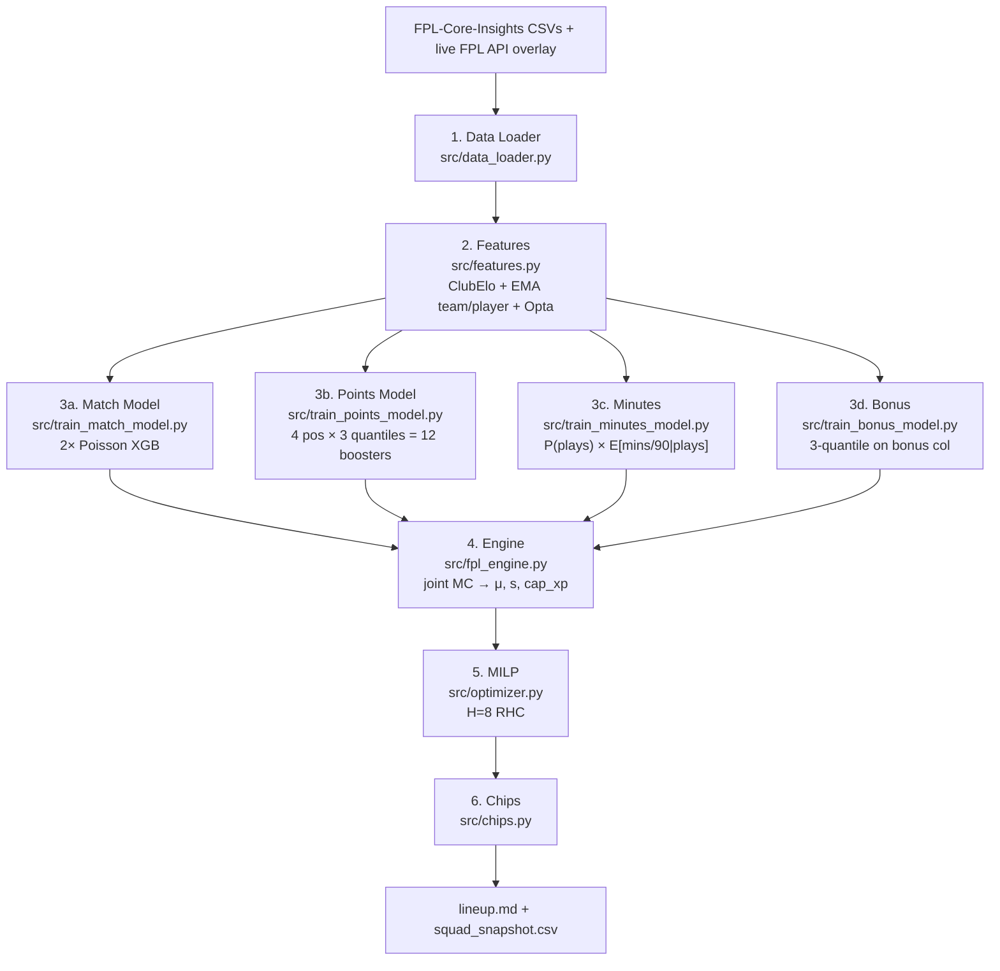

# Autonomous Fantasy Premier League ML Manager

[](https://www.python.org/)
[](https://xgboost.readthedocs.io/)
[](https://coin-or.github.io/pulp/)
[](../.github/workflows/pipeline.yml)

Agent dự đoán và quản lý đội hình FPL tự động dựa trên dữ liệu. Chọn + quản lý squad 15 cầu thủ. Pipeline gồm: hồi quy quantile bằng boosting để dự đoán phân phối điểm theo vị trí; mô hình hai giai đoạn dự đoán số phút với tín hiệu xoay tua cup; Poisson độc lập cho bàn thắng trận đấu; MILP tối ưu squad + XI + đội trưởng theo rolling horizon; lên lịch chip bằng greedy + alt-solve. Dữ liệu từ [olbauday/FPL-Core-Insights](https://github.com/olbauday/FPL-Core-Insights) (FPL API + Opta + ClubElo + lịch EFL/UEFA cup, 2 lần/ngày) + live FPL API để cập nhật giá và chấn thương.

> **Mới chơi FPL?** Xem [FPL 101 primer](FPL_101.md).
> **Phạm vi:** Nghiên cứu / cá nhân.

---

## Table of Contents

1. [Architecture](#1-architecture)
2. [Features](#2-features)
3. [Match Model](#3-match-model)
4. [Points Model](#4-points-model)
5. [Optimization](#5-optimization)
6. [Chips](#6-chips)
7. [Validation](#7-validation)
8. [Layout](#8-layout)
9. [Install + Run](#9-install--run)
10. [Future Work](#10-future-work)
11. [References](#11-references)
12. [Data + Credit](#data--credit)
13. [License](#license)

---

## 1. Architecture

Toàn bộ luồng xử lý end-to-end. Từ file CSV + dữ liệu live → báo cáo markdown (squad, XI, đội trưởng, chuyển nhượng, hits, chips). Cập nhật 2 lần/ngày.



Các artifact được lưu trong `data/`. Chỉ train lại khi thiếu. GitHub Actions [.github/workflows/pipeline.yml](../.github/workflows/pipeline.yml) chạy lúc 05:30 + 17:30 UTC, 30 phút sau khi nguồn dữ liệu refresh. Walk-forward recalib tự kích hoạt khi JSON cũ hơn `RECALIB_STALE_DAYS` (= 14 ngày) — xem `_maybe_recalibrate` trong [src/main.py](../src/main.py).

**Guards trong [src/main.py](../src/main.py)**: (a) `_ensure_models` kiểm tra `feature_names` của booster đã cache so với output của `features.py` (`_schema_drift`); tự train lại và xóa recalib JSON tương ứng nếu lệch. (b) `_gw_in_play` bỏ qua pipeline khi đang có trận đấu diễn ra (kickoff trong 3h qua, `finished=False`) hoặc sắp diễn ra (2h tới) — tránh chạy vô ích giữa GW.

---

## 2. Features

[src/features.py](../src/features.py). Hai nhóm feature: trạng thái đội (match model) và lag cầu thủ (points model). Phân vùng GW nghiêm ngặt shift-1 để tránh data leakage.

### 2.1 Team Elo

Elo trước trận theo từng fixture từ FPL-CI (ClubElo, point-in-time). Lưu thành `elo_h_pre` / `elo_a_pre`. Replay theo thứ tự thời gian dùng làm fallback khi null.

Elo tiêu chuẩn: kỳ vọng từ chênh lệch rating + HFA; cập nhật theo K × hệ số MoV × (thực tế − kỳ vọng). MoV theo FiveThirtyEight sports-Elo — giảm ảnh hưởng của thắng đậm, thưởng cho thắng thuyết phục.

| Siêu tham số (fallback) | Giá trị |
| --- | --- |
| K | 20 |
| HFA | 60 Elo |
| Init | 1500 |

### 2.2 Rolling team + player metrics

**Match**: EMA halflife $w/2$, $w \in \{3,5,10\}$ FPL block, $w=5$ Opta block. Shift-1. GW gần đây giảm chậm, không có hard cutoff.

| Nguồn | Thống kê |
| --- | --- |
| FPL `history` tổng hợp | xG, xGA, GF, GA |
| Opta team-level `fixtures.csv` | Opta xG (`oxg`), big chances (`obc`), shots (`osh`) + bàn thua |

**Stakes** ([src/league_table.py](../src/league_table.py)): bảng xếp hạng theo (season, event) từ các trận đã kết thúc. Khoảng cách điểm có dấu đến các ngưỡng (vô địch / top 4 UCL / top 6 châu Âu / trụ hạng hạng 17), chuẩn hóa theo số trận còn lại tối đa. Match model: `h_*` + `a_*`. Points model: `own_*` / `opp_*`. Phản ánh thay đổi cuối mùa (đua vô địch, chế độ nghỉ hè, trụ hạng).

**Points**: lag phút $m_{t-1,2,3}$ + rolling 5/10-GW theo cầu thủ (xG, xA, xGI, BPS, ICT, saves, CBI, tackles, recoveries) + sáu chỉ số Opta từ `playermatchstats.csv`. Ngữ cảnh fixture từ join match-feature: `is_home`, `opp_xg_5`, `opp_xga_5`, `opp_elo`, `own_elo`, `elo_gap`. Flag set-piece + penalty từ playerstats. `total_points` rolling bị loại — nguy cơ feedback-loop; xG/xA/ICT đã mang tín hiệu form đủ.

### 2.3 Cup congestion (minutes head)

[src/features.py](../src/features.py) `_team_cup_congestion` + [src/data_loader.py](../src/data_loader.py) `_build_cup_fixtures`. Số trận cup non-PL trong ±`CUP_WINDOW_DAYS` (= 3 ngày) quanh mỗi trận PL, theo (team, event, season). Nguồn: `EFL Cup`, `Champions League`, `Europa League`, `Conference League` từ FPL-CI. Output → `data/cup_fixtures.csv`.

| Cột | Ý nghĩa |
| --- | --- |
| `cup_pre` | Trận cup trong $[-W, 0)$ ngày (xoay tua do mệt mỏi gần đây) |
| `cup_post` | Trận cup trong $[0, +W]$ ngày (ưu tiên trận sắp tới) |
| `cup_total` | `cup_pre + cup_post` |
| `days_to_next_cup` | `min(positive delta_days)`; sentinel 999 nếu không có |

Chỉ dùng cho **minutes head** — nắm bắt tín hiệu xoay tua (ví dụ Chelsea nghỉ EPL XI trước chung kết UECL) mà lag phút thuần túy không thể dự đoán trước khi lần dự bị đầu tiên xảy ra. Points head không dùng cup cols — xoay tua đã được phản ánh qua `mins_pred` giảm.

---

## 3. Match Model

[src/train_match_model.py](../src/train_match_model.py).

### 3.1 Poisson goals

Hai bộ hồi quy XGBoost `count:poisson` độc lập → expected goals mỗi bên. Backbone: XGBoost. Vector feature 31 chiều từ §2.

### 3.2 Clean sheets

CS = marginal Poisson độc lập: $P(\text{home CS}) = e^{-\lambda_a}$, $P(\text{away CS}) = e^{-\lambda_h}$. Ghi vào `fixture_lambdas.csv` (`cs_h_p`, `cs_a_p`). Dùng làm feature trong points head (`own_cs_p`, `opp_cs_p`).

---

## 4. Points Model

[src/train_points_model.py](../src/train_points_model.py).

### 4.1 Quantile boosters

Điểm FPL: rời rạc, heavy-tailed, bimodal (không ra sân = 0 + phân tán khi ra sân).

| Quantile | Mục đích |
| --- | --- |
| q10 | Sàn, độ phân tán |
| q50 | Median anchor → Swanson μ (§4.4) |
| q90 | Thời điểm TC, độ phân tán |

**Booster theo vị trí** — 4 × 3 = 12 — `reg:quantileerror`, $\alpha \in \{0.10, 0.50, 0.90\}$. Mục tiêu: `total_points` thô (trừ bonus, xem §4.8). Bao gồm bàn thắng, kiến tạo, CS, BPS, trừ điểm cùng lúc. Không cần bảng tính điểm thủ công.

Phân theo vị trí để tránh bẫy trung bình tổng thể — phân phối điểm khác nhau theo cấu trúc (GK saves, DEF CS, MID ghi bàn+kiến tạo, FWD ghi bàn).

### 4.2 Non-crossing

Các quantile fit độc lập có thể bị đảo. Row-sort dự đoán tăng dần khi inference. Ảnh hưởng < 2% hàng.

### 4.3 Inference: DGWs, BGWs, injuries

Mỗi (i, t): một feature row cho mỗi fixture mà đội cầu thủ thi đấu trong GW đó (0/1/2 trận).

**Mixture-quantile transform qua two-stage minutes head**: `binary:logistic` $P(\text{plays})$ trên toàn bộ rows + `reg:logistic` $E[\text{mins}/90 \mid \text{plays}]$ trên subset đã ra sân; quantile points + bonus heads đều train trên rows `minutes > 0`, nên dự đoán $q_\alpha$ là **conditional quantiles**. Phân phối điểm unconditional là hỗn hợp zero-inflated, với:

$$q_\alpha^\text{unc} = \begin{cases} 0 & \alpha \leq 1-p \\ F_\text{played}^{-1}\!\left(\dfrac{\alpha-(1-p)}{p}\right) & \alpha > 1-p \end{cases}$$

DGW clip ở 1. GW tiếp theo: `chance_of_playing_next_round / 100` từ FPL API = giới hạn trên cứng cho xác suất ra sân; status `s`/`n`/`u` sẽ zero hàng đó.

**Aggregation across fixtures** theo (i, t): tổng các moment theo phương sai-cộng trong GW của cầu thủ. BGW → 0. DGW cộng dồn ở mức $(\mu, \sigma^2)$.

### 4.4 Swanson mean + dispersion

Optimizer cần scalar μ + dispersion s cho mỗi (i, t). FPL lệch phải → median q50 thấp hơn mean. Swanson / Keefer–Bodily 3-quantile: $\mu = 0.3 q_{10} + 0.4 q_{50} + 0.3 q_{90}$.

Dispersion: $s = (q_{90} - q_{10}) / 2.56$ (std, không phải variance). Phạt linear `−λ·s` giữ risk trên thang EV.

### 4.5 Captaincy score

Tách biệt khỏi chọn XI. Neo trên μ + phần upside:

$$\kappa = \mu + \gamma (q_{90} - \mu), \quad \gamma = 0.3$$

`CAP_UPSIDE_WEIGHT` trong [src/fpl_engine.py](../src/fpl_engine.py). Thấp hơn (0.2) → an toàn hơn; cao hơn (0.5+) → đuổi boom.

### 4.6 Isotonic points recalib

Map đơn điệu non-parametric theo (pos, α) khi inference để bù khoảng cách pinball/coverage trên played-only rows. [src/recalibrate_points.py](../src/recalibrate_points.py). Affine fallback khi hàng < `MIN_ROWS_ISOTONIC` (= 400).

### 4.7 Isotonic minutes recalib

Map isotonic đơn điệu theo vị trí trên raw minutes/90 booster. [src/recalibrate_minutes.py](../src/recalibrate_minutes.py). Knots → `data/minutes_recalib.json`.

### 4.8 Bonus head (variance-additive combine)

[src/train_bonus_model.py](../src/train_bonus_model.py). Bonus ∈ {0,1,2,3} = top-3 BPS scorers mỗi trận. Ba quantile boosters, model chung (sparse target), train trên rows `minutes > 0`. Points head train trên `total_points - bonus` → không double-count.

Engine kết hợp points + bonus heads ở cấp moment, không cộng quantile trực tiếp (không hợp lệ về thống kê):

$$\mu_c = \mu_p + \beta\,\mu_b, \qquad \sigma_c^2 = \sigma_p^2 + \beta^2\,\sigma_b^2$$

`BONUS_BLEND` ($\beta$, mặc định 1.0) scale đều bonus moments.

### 4.9 Joint MC aggregation

[src/fpl_engine.py](../src/fpl_engine.py) `_joint_mc_aggregate`. Sampler đặt thêm **position-factor vector** $f \sim \mathcal{N}(0, C)$ theo từng (team, GW) lên idiosyncratic $\varepsilon$, với $C \in \mathbb{R}^{4 \times 4}$ là ma trận tương quan vị trí trong cùng đội từ `data/team_rho.json`. Nắm bắt hiệp phương sai trong câu lạc bộ (Liverpool CS đẩy Virgil + Salah cùng lúc).

`MC_SAMPLES = 800`. Theo (i, t): tổng điểm draw-level qua các fixture DGW trong draw, lấy sample mean (μ), std (s), 90th-quantile (`cap_xp`).

---

## 5. Optimization

[src/optimizer.py](../src/optimizer.py). PuLP + bundled CBC.

### 5.1 Decision vars

Mỗi cầu thủ $i \in \{1..N\}$ + GW $t \in \{t_0..t_0+H-1\}$, $H = 8$:

| Biến | Miền | Ý nghĩa |
| --- | --- | --- |
| $x_{i,t}$ | nhị phân | Trong squad 15 người |
| $s_{i,t}$ | nhị phân | Trong XI |
| $c_{i,t}$ | nhị phân | Đội trưởng |
| $\text{tin}_{i,t}$ | nhị phân | Chuyển nhượng VÀO |
| $\text{ft}_t$ | int 1–5 | Free transfers còn lại |
| $\text{sv}_t$ | int 0–5 | FT tiết kiệm |
| $h_t$ | int ≥ 0 | Hit 4 điểm |

### 5.2 Objective

Tối đa hóa tổng horizon: EV starter ($\mu s$) + bench auto-sub EV ($b \mu (x-s)$, $b = 0.15$) + đội trưởng ($\kappa c$) − rủi ro ($\nu s x$, linear) + EO tilt ($\eta \mu (1-\text{EO}) x$, mặc định 0) − hit cost ($4 h_t$).

- **Risk linear theo std, không phải variance** — CBC LP-only; $s^2$ cần MIQP.
- **EO tilt** mặc định 0 → EV thuần. $\eta > 0$ → chọn differentials.

### 5.3 Structural constraints (mỗi t)

- Squad = 15. Quota: 2 GK, 5 DEF, 5 MID, 3 FWD.
- ≤ 3 cầu thủ mỗi câu lạc bộ.
- Budget ≤ giá trị squad trước + bank.
- XI = 11, đội trưởng = 1, $c ≤ s ≤ x$.
- **Đội trưởng chỉ từ MID/FWD**: $c = 0$ với GK/DEF.
- Formation: 1 GK, ≥3 DEF, ≥2 MID, ≥1 FWD.

### 5.4 Transfers

- $\text{ft}_t = \min(5, 1 + \text{sv}_{t-1})$ cho $t > t_0$.
- Hit cost $C_h = 6$ (FPL danh nghĩa 4, tăng để hạn chế churn). $H_\text{max} = 1$.
- **Banking reward** $\omega \text{sv}_t$ ($\omega = 0.3$) — option value của FT rolled sang GW sau.

### 5.5 RHC

Look-ahead $H = 8$ tuần. Chiết khấu hình học $w_k = \gamma^k$, $\gamma = 0.85$. Chỉ thực thi $t_0$: `transfers_in/out`, `xi_ids`, `captain`, `vice`, `hits`. Tuần sau giải lại từ đầu.

---

## 6. Chips

[src/chips.py](../src/chips.py). Greedy post-processing trên projection frame.

**Luật 2025/26**: 8 chips, hai bộ mỗi loại. Bộ 1 (TC1/BB1/FH1/WC1) hết hạn GW19. Bộ 2 từ GW20+. TC × 3. FH không được chơi hai GW liên tiếp. WC + FH giữ nguyên FT đã tích lũy.

| Chip | Heuristic |
| --- | --- |
| **TC** (×3) | GW + MID/FWD đang sở hữu có $\kappa$ cao nhất |
| **BB** | GW tối đa $\sum_\text{bench} \mu$ |
| **FH** | GW có nhiều đội blank nhất. Không liên tiếp |
| **WC** | Kích hoạt nếu RHC đề xuất ≥4 chuyển nhượng VÀO hoặc ≥2 hits |

---

## 7. Validation

[src/backtest.py](../src/backtest.py) + [src/calibration.py](../src/calibration.py). Ba heads (points, match, minutes). Chạy: `python src/backtest.py --k 5` hoặc `--start S --end E`. Output → `data/processed/backtest/`.

### 7.1 Walk-forward CV

Mỗi holdout GW $G$: train lại trên `round < G`, dự đoán `round = G`. Feature rolling shift-1 → frame xây một lần trên toàn bộ lịch sử, không bị leakage miễn là `round ≥ G` bị loại khỏi training.

### 7.2 Points calibration

Hai phạm vi theo (pos, quantile):
- **all** — mọi (cầu thủ, GW) kể cả DNPs (y=0 làm tăng coverage đuôi dưới).
- **played** — `minutes > 0`. Production-conditional, dùng cho recalib §4.6.

### 7.3 Match calibration

Marginal Poisson NLL, goal MAE, CS Brier, CS rate gap trên từng bên theo fixture holdout.

### 7.4 Minutes audit

Walk-forward mins/90 + binary `played`: MAE, ROC-AUC, Brier, reliability 10 bin. Chạy với `--minutes-recalib data/minutes_recalib.json` để audit dự đoán đã calibrate.

---

## 8. Layout

```text
fpl-ml-manager/
├── src/
│   ├── main.py                  # Orchestrator + viết report
│   ├── data_loader.py           # FPL-CI CSV + live API overlay
│   ├── features.py              # Elo + rolling + Opta
│   ├── train_match_model.py     # Poisson goals + CS marginals
│   ├── train_points_model.py    # 12 quantile boosters
│   ├── train_minutes_model.py   # Two-stage P(plays) × E[mins/90|plays]
│   ├── train_bonus_model.py     # 3 quantile boosters cho FPL bonus
│   ├── fit_team_rho.py          # Fit tương quan trong đội
│   ├── fpl_engine.py            # Inference + projection frame + joint MC
│   ├── optimizer.py             # MILP + RHC
│   ├── chips.py                 # Heuristic TC/BB/FH/WC
│   ├── backtest.py              # Walk-forward CV
│   ├── calibration.py           # Coverage/pinball/Brier
│   ├── recalibrate_points.py    # Isotonic/affine theo (pos,α)
│   ├── recalibrate_minutes.py   # Isotonic theo vị trí
│   ├── league_table.py          # Bảng xếp hạng + stakes
│   └── season_replay.py         # Backtest theo từng GW có chip
├── data/
│   ├── players.csv, teams.csv, fixtures.csv, history.csv
│   ├── cup_fixtures.csv                     # Nguồn congestion EFL/UCL/UEL/UECL
│   ├── fixture_lambdas.csv                  # λ_h, λ_a, cs_{h,a}_p theo fixture
│   ├── season_replay.csv                    # Trạng thái replay (CI gate đọc file này)
│   ├── xgb_home_goals.json, xgb_away_goals.json
│   ├── xgb_points_q{10,50,90}_p{1,2,3,4}.json
│   ├── xgb_minutes_plays.json               # P(plays)
│   ├── xgb_minutes_when_played.json         # E[mins/90 | plays]
│   ├── xgb_bonus_q{10,50,90}.json
│   ├── points_recalib.json
│   ├── minutes_recalib.json
│   ├── team_rho.json
│   └── processed/
│       ├── lineup.md                    # Báo cáo hàng tuần
│       ├── squad_snapshot.csv           # Trạng thái RHC tiếp theo
│       ├── season_replay.md             # Báo cáo replay theo GW có chip
│       └── backtest/                    # Dự đoán + bảng calibration
├── docs/
│   ├── README.md
│   └── FPL_101.md
└── .github/workflows/
    ├── pipeline.yml             # FPL Daily Update — 05:30 + 17:30 UTC hàng ngày
    └── season_replay.yml        # Tự kích hoạt khi pipeline thành công
```

---

## 9. Install + Run

### Requirements

- Python 3.11+
- Không cần GPU — XGBoost CPU đủ nhanh.

### Local setup

```bash
git clone https://github.com/truong-tt/fpl-ml-manager
cd fpl-ml-manager
python3.11 -m venv .venv
source .venv/bin/activate          # Windows: .venv\Scripts\activate
pip install -r requirements.txt
python src/main.py
```

Lần đầu chạy sẽ train toàn bộ artifact. Các lần sau reuse `data/*.json`, chỉ train lại khi thiếu. Output → [data/processed/lineup.md](../data/processed/lineup.md). State → [data/processed/squad_snapshot.csv](../data/processed/squad_snapshot.csv).

### Chạy trên GitHub Actions

1. Push repo lên GitHub
2. Vào tab **Actions** → chọn **"FPL Daily Update"** → nhấn **"Run workflow"**
3. Sau khi chạy xong, xem kết quả trong phần **Summary** của workflow run — `lineup.md` được render đẹp ở đó

Tự động chạy: **05:30 + 17:30 UTC** mỗi ngày (tức 12:30 và 00:30 giờ Việt Nam).

### Recalibration

Tự động. `_maybe_recalibrate(...)` chạy walk-forward retrain khi JSON cũ hơn `RECALIB_STALE_DAYS` (= 14) hoặc bị thiếu.

Thủ công:

```bash
# Buộc refresh
rm data/points_recalib.json data/minutes_recalib.json
python src/main.py

# Walk-forward CV
python src/backtest.py --k 8

# Refit (dùng backtest/*.csv)
python src/recalibrate_points.py
python src/recalibrate_minutes.py

# Audit minutes đã calibrate
python src/backtest.py --k 8 --minutes-recalib data/minutes_recalib.json
```

### Scheduled

[.github/workflows/pipeline.yml](../.github/workflows/pipeline.yml) chạy 2 lần/ngày 05:30 + 17:30 UTC, 30 phút sau khi FPL-CI refresh. Idempotent — chỉ commit khi artifact thay đổi. `concurrency: fpl-update` tránh chạy đồng thời.

---

## 10. Future Work

1. **Rank-EV via end-of-season MC** — mở rộng `_joint_mc_aggregate` để mô phỏng toàn bộ trajectory còn lại của mùa giải; thay thế MILP points-EV bằng EO-weighted percentile.
2. **MIQP risk** — thay diagonal linear $-\nu s$ bằng quadratic đầy đủ $x^\top \Sigma x$. Yêu cầu Gurobi/CPLEX/SCIP — CBC chỉ hỗ trợ LP.
3. **Result-distribution head** — mô hình xác suất W/D/L từ joint Poisson PMF (với Dixon–Coles τ correction). Cho DEF/GK head tín hiệu CS có cấu trúc tốt hơn.
4. **Regime breaks** — phát hiện thay đổi HLV / người đá set-piece mới làm vô hiệu rolling features. EMA halflife làm mượt nhưng không reset.
5. **Learned chip scheduler** — mở rộng MILP. EV chip phụ thuộc vào path transfer plan + thời điểm DGW; greedy post-processing trong [src/chips.py](../src/chips.py) bỏ lỡ các tương tác này.
6. **Strict walk-forward replay** — `season_replay.py` hiện dùng production heads (train trên toàn mùa → leakage parameter nhẹ). Retrain theo từng GW `round < G` sẽ cho out-of-sample thực sự.

---

## 11. References

### Boosting + quantile

- [XGBoost][ref-xgboost] — Chen & Guestrin, KDD 2016. Backbone.
- [Regression Quantiles][ref-koenker] — Koenker & Bassett, Econometrica 1978. Pinball loss.
- [Quantile Curves Without Crossing][ref-chernozhukov] — Chernozhukov, Fernández-Val & Galichon, Econometrica 2010.

### Ratings

- [Hvattum & Arntzen 2010][ref-hvattum] — Elo → bóng đá, xác nhận với bookmaker.
- [538 NBA Elo][ref-538] — hệ số MoV.

### Optimization

- [Hunter, Vielma & Zaman 2016][ref-hvz] — DFS portfolio integer programming.
- [Mayne MPC 2014][ref-mpc] — tài liệu tham khảo chuẩn về RHC.
- [PuLP][ref-pulp] — lớp modeling trên CBC.

### Future-work refs

- [Dixon & Coles 1997][ref-dc] — τ low-score correction.

### Data

- [olbauday/FPL-Core-Insights][ref-fpl-ci] — nguồn dữ liệu chính.
- [FPL Public API][ref-fpl] — live overlay (giá, ownership, status, `chance_of_playing_next_round`).
- [ClubElo][ref-clubelo] — qua FPL-CI `fixtures.csv`.

[ref-xgboost]: https://arxiv.org/abs/1603.02754
[ref-dc]: https://www.ajbuckeconbikesail.net/wkpapers/Airports/MVPoisson/soccer_betting.pdf
[ref-koenker]: https://people.eecs.berkeley.edu/~jordan/sail/readings/koenker-bassett.pdf
[ref-chernozhukov]: http://alfredgalichon.com/wp-content/uploads/2012/10/Econometrica_article_may-2010.pdf
[ref-538]: https://fivethirtyeight.com/features/how-we-calculate-nba-elo-ratings/
[ref-hvz]: https://arxiv.org/abs/1604.01455
[ref-mpc]: https://doi.org/10.1016/j.automatica.2014.10.128
[ref-hvattum]: https://www.sciencedirect.com/science/article/abs/pii/S0169207009001708
[ref-pulp]: https://github.com/coin-or/Cbc
[ref-fpl]: https://fantasy.premierleague.com/api/
[ref-fpl-ci]: https://github.com/olbauday/FPL-Core-Insights
[ref-clubelo]: https://clubelo.com

---

## Data + Credit

Toàn bộ credit thuộc về các nguồn ở §11. Tuân theo điều khoản của từng nhà cung cấp. Các endpoint/file công khai, chỉ đọc. Không liên kết với Premier League, ClubElo, FPL-Core-Insights.

---

## License

TBD.

> **Lưu ý:** FPL API, FPL-CI, ClubElo được điều chỉnh bởi các điều khoản riêng biệt.