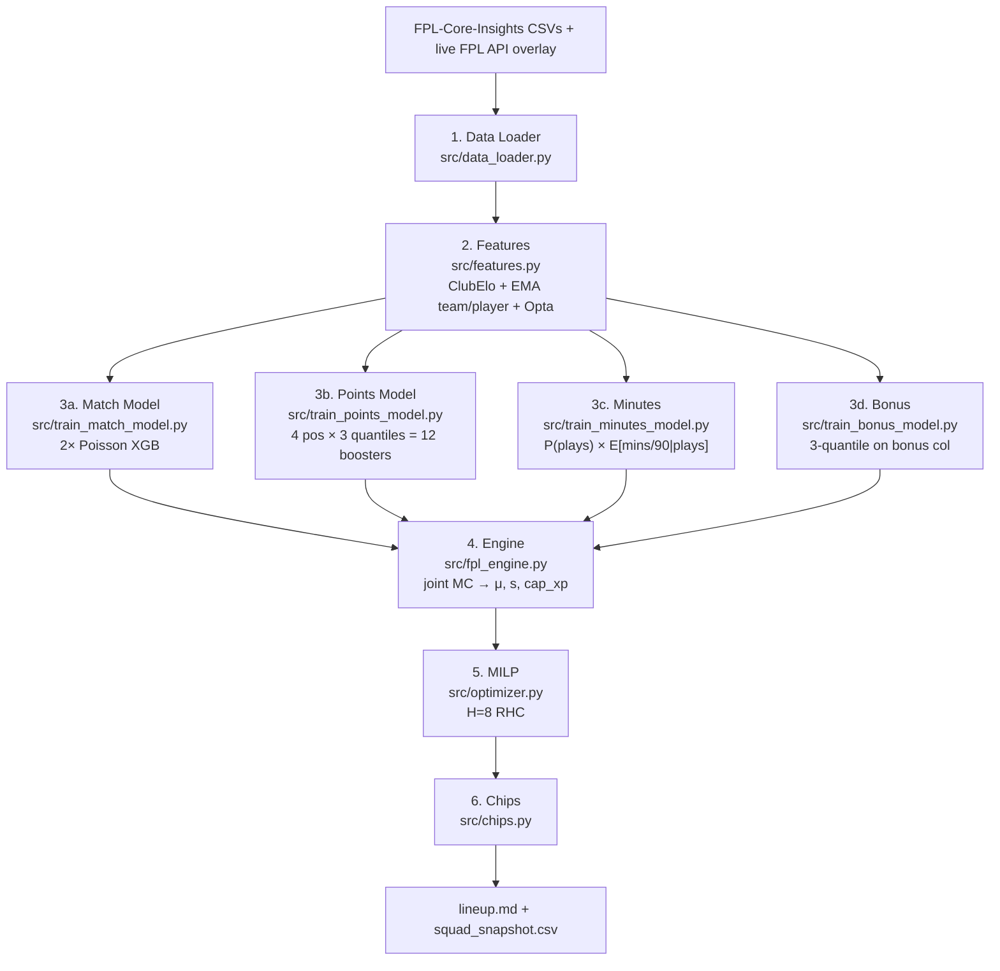

# Autonomous Fantasy Premier League ML Manager

[](https://www.python.org/)
[](https://xgboost.readthedocs.io/)
[](https://coin-or.github.io/pulp/)
[](../.github/workflows/pipeline.yml)

Data-driven agent. Picks + manages 15-player FPL squad. Pipeline: quantile-regression boosting for per-position point distributions; two-stage minutes head with cup-congestion rotation signal; independent Poisson for match goals; MILP for squad + XI + captain over rolling horizon; greedy + alt-solve chip scheduling. Data: [olbauday/FPL-Core-Insights](https://github.com/olbauday/FPL-Core-Insights) CSVs (FPL API + Opta + ClubElo + EFL/UEFA cup fixtures, 2×/day) + live FPL API overlay for prices + injuries.

> **New to FPL?** See [FPL 101 primer](FPL_101.md).
> **Scope:** Research / personal.

---

## Table of Contents

1. [Architecture](#1-architecture)
2. [Features](#2-features)
3. [Match Model](#3-match-model)
4. [Points Model](#4-points-model)
5. [Optimization](#5-optimization)
6. [Chips](#6-chips)
7. [Validation](#7-validation)
8. [Layout](#8-layout)
9. [Install + Run](#9-install--run)
10. [Future Work](#10-future-work)
11. [References](#11-references)
12. [Data + Credit](#data--credit)
13. [License](#license)

---

## 1. Architecture

End-to-end. CSVs + live overlay → markdown report (squad, XI, captain, transfers, hits, chips). 2×/day refresh.



Artifacts persist under `data/`. Retrain only missing. GitHub Actions [.github/workflows/pipeline.yml](../.github/workflows/pipeline.yml) runs 05:30 + 17:30 UTC, 30 min after upstream refresh. Walk-forward recalib auto-fires when JSONs > `RECALIB_STALE_DAYS` (= 14) — `_maybe_recalibrate` in [src/main.py](../src/main.py).

**Guards in [src/main.py](../src/main.py)**: (a) `_ensure_models` checks cached booster `feature_names` vs `features.py` output (`_schema_drift`); forces retrain + wipes matching recalib JSON. (b) `_gw_in_play` short-circuits when fixture live (kickoff last 3h, `finished=False`) or imminent (next 2h) — no useless lineup mid-GW.

---

## 2. Features

[src/features.py](../src/features.py). Two families: team-state (match model); player lags (points model). Strict shift-1 GW partitioning prevents leakage.

### 2.1 Team Elo

Pre-match Elo per fixture from FPL-CI (ClubElo, point-in-time). Stamped `elo_h_pre` / `elo_a_pre`. Chronological replay = fallback when null.

Standard Elo: expected from rating diff + HFA; update by K × MoV-multiplier × (actual − expected). MoV from FiveThirtyEight sports-Elo ([How We Calculate NBA Elo Ratings][ref-538]) — dampens blowouts, rewards decisive wins. Elo→football validated by [Hvattum & Arntzen][ref-hvattum].

| Hyperparam (fallback) | Value |
| --- | --- |
| K | 20 |
| HFA | 60 Elo |
| Init | 1500 |

### 2.2 Rolling team + player metrics

**Match**: EMA halflife $w/2$, $w \in \{3,5,10\}$ FPL block, $w=5$ Opta block. Shift-1. Recent GWs decay slow, no hard cutoff.

| Source | Stats |
| --- | --- |
| Aggregated FPL `history` | xG, xGA, GF, GA |
| Opta team-level `fixtures.csv` | Opta xG (`oxg`), big chances (`obc`), shots (`osh`) + conceded |

**Stakes** ([src/league_table.py](../src/league_table.py)): per-(season, event) standings from finished fixtures. Signed pts gap to tier cutoffs (title / UCL top-4 / Euro top-6 / safety 17th), normalized by max remaining. Match model: `h_*` + `a_*`. Points model: `own_*` / `opp_*`. Encodes late-season step-changes (title chase, beach mode, drop-fight).

**Points**: lagged minutes $m_{t-1,2,3}$ + 5/10-GW per-player rolling means (xG, xA, xGI, BPS, ICT, saves, CBI, tackles, recoveries) + six Opta from `playermatchstats.csv` (`oxg`, `oxa`, `occ`, `otob`, `osh`, `odrib`). Fixture ctx from match-feature join: `is_home`, `opp_xg_5`, `opp_xga_5`, `opp_elo`, `own_elo`, `elo_gap`. Set-piece + pen flags from playerstats. Rolling `total_points` excluded — feedback-loop risk; underlying xG/xA/ICT carry form signal cleanly.

### 2.3 Cup congestion (minutes head)

[src/features.py](../src/features.py) `_team_cup_congestion` + [src/data_loader.py](../src/data_loader.py) `_build_cup_fixtures`. Per-(team, event, season) count of non-PL cup matches within ±`CUP_WINDOW_DAYS` (= 3) of each PL kickoff. Sources: `EFL Cup`, `Champions League`, `Europa League`, `Conference League` from FPL-CI `By Tournament/<cup>/GW{n}/{fixtures,matches}.csv`. Foreign-club opponents dropped at remap — row stays tied to English side. Output → `data/cup_fixtures.csv`.

| Col | Meaning |
| --- | --- |
| `cup_pre` | Cup matches in $[-W, 0)$ days (recent-fatigue rotation) |
| `cup_post` | Cup matches in $[0, +W]$ days (upcoming-priority rotation) |
| `cup_total` | `cup_pre + cup_post` |
| `days_to_next_cup` | `min(positive delta_days)`; sentinel 999 when none |

Pivoted to `own_*` via `is_home` at engine inference (refreshed per upcoming fixture, not stale historical row — see [src/fpl_engine.py](../src/fpl_engine.py) `_inference_rows`). Consumed by **minutes head only** — captures rotation signal (e.g. Chelsea resting EPL XI before UECL final) that pure lag-minutes can't anticipate before first benching. Points head doesn't see cup cols — rotation already mediated via reduced `mins_pred`.

---

## 3. Match Model

[src/train_match_model.py](../src/train_match_model.py).

### 3.1 Poisson goals

Two independent XGBoost `count:poisson` regressors → expected goals per side. Backbone: [XGBoost][ref-xgboost]. 31-dim feature vec from §2.

### 3.2 Clean sheets

CS = independent-Poisson marginal: $P(\text{home CS}) = e^{-\lambda_a}$, $P(\text{away CS}) = e^{-\lambda_h}$. Written to `fixture_lambdas.csv` (`cs_h_p`, `cs_a_p`). Consumed as features in points head (`own_cs_p`, `opp_cs_p`).

---

## 4. Points Model

[src/train_points_model.py](../src/train_points_model.py).

### 4.1 Quantile boosters

FPL points: discrete, heavy-tailed, bimodal (DNP zero + wide when playing).

| Quantile | Use |
| --- | --- |
| q10 | Floor, spread |
| q50 | Median anchor → Swanson μ (§4.4) |
| q90 | TC timing, spread |

**Per-position** boosters — 4 × 3 = 12 — `reg:quantileerror`, $\alpha \in \{0.10, 0.50, 0.90\}$. Pinball loss from [Koenker & Bassett][ref-koenker]. Target: raw `total_points` (minus bonus, see §4.8). Subsumes goals, assists, CS, BPS, deductions jointly. No hand-coded scoring table.

Per-position to break population-mean trap — scoring distributions differ structurally (GK saves, DEF CS, MID score+assist, FWD convert). Trade-off: ~3k rows/FWD subset, q90 outlier-sensitive. Regularization: `max_depth=3`, `min_child_weight=30`, `reg_alpha=0.5`, `reg_lambda=2.0` + sanity clip at 25 (credible boom: hat-trick + assist + bonus).

### 4.2 Non-crossing

Independent quantile fits can cross. Row-sort predictions ascending at inference. Affects <2% rows.

### 4.3 Inference: DGWs, BGWs, injuries

Per (i, t): one feature row per fixture player's club plays that GW (0/1/2).

**Mixture-quantile transform via two-stage minutes head** ([src/train_minutes_model.py](../src/train_minutes_model.py)): `binary:logistic` $P(\text{plays})$ on full row set + `reg:logistic` $E[\text{mins}/90 \mid \text{plays}]$ on played-only subset; minutes feature subset is the minutes-only superset of points cols (drops set-piece + per-action rolling — circular for predicting playing time) + cup-congestion §2.3. Both points + bonus heads train on `minutes > 0` rows, so their predicted $q_\alpha$ are **conditional** quantiles $F_\text{played}^{-1}(\alpha)$. The unconditional points distribution is the zero-inflated mixture (DNP with prob $1-p$, else $Y \sim F_\text{played}$), whose CDF inverts to

$$
q_\alpha^\text{unc} = \begin{cases} 0 & \alpha \leq 1-p \\ F_\text{played}^{-1}\!\left(\dfrac{\alpha-(1-p)}{p}\right) & \alpha > 1-p \end{cases}
$$

with $p = P(\text{plays})$. `_mixture_quantile` in [src/fpl_engine.py](../src/fpl_engine.py) approximates $F_\text{played}^{-1}$ by piecewise-linear interpolation through the three known knots $(0.1, q_{10}),\,(0.5, q_{50}),\,(0.9, q_{90})$. This is the statistically correct unconditional transform — replaces the older $q_\alpha \cdot p$ heuristic, which is valid only for the mean ($E[\mathbb{1}\cdot Y] = p\,E[Y]$) and under-counts $q_{90}$ for rotation-prone high-ceiling profiles while inflating $q_{10}$ above 0 whenever $\alpha \leq 1-p$. DGW clip at 1. Next GW: FPL `chance_of_playing_next_round / 100` = hard upper bound on plays; statuses `s`/`n`/`u` zero the row.

**Aggregation across fixtures** per (i, t): variance-additive sum of moments within the player's GW. BGW → 0. DGW stacks additively at the $(\mu, \sigma^2)$ level so the joint $q_\alpha$ of a double-fixture week reflects $\sqrt{2}\,\sigma$ dispersion rather than $2\sigma$.

### 4.4 Swanson mean + dispersion

Optimizer needs scalar μ + dispersion s per (i, t). FPL right-skewed → median q50 under-shoots mean. Swanson / Keefer–Bodily 3-quantile: $\mu = 0.3 q_{10} + 0.4 q_{50} + 0.3 q_{90}$. Calibrated to lognormal-family distributions.

Dispersion: central mass ≈ Gaussian → q10–q90 ≈ 2.56 σ. Emit **std** $s = (q_{90} - q_{10}) / 2.56$, not variance (CBC LP-only, no MIQP). Linear `−λ·s` penalty keeps risk on EV scale; $s^2$ would over-punish ceilings.

### 4.5 Captaincy score

Separate from XI selection. Anchor on μ + fraction of upside:

$$\kappa = \mu + \gamma (q_{90} - \mu), \quad \gamma = 0.3$$

`CAP_UPSIDE_WEIGHT` in [src/fpl_engine.py](../src/fpl_engine.py). Lower (0.2) → safer; higher (0.5+) → boom-chase.

### 4.6 Isotonic points recalib

Per-(pos, α) monotone non-param map at inference closes pinball/coverage gap on played-only rows. [src/recalibrate_points.py](../src/recalibrate_points.py):

1. Equal-frequency bin `q_pred` into ~20 buckets per cell.
2. Per bin, take empirical α-quantile of `y` as target.
3. Fit `sklearn.isotonic.IsotonicRegression(out_of_bounds="clip")`. Knots → `{type: "iso", knots: [[x,y],…]}`.

Affine fallback $a + b q_\text{pred}$, $b \in [0.1, 5.0]$, for cells with rows < `MIN_ROWS_ISOTONIC` (= 400). Slope floor preserves per-row ranking. Stored `{type: "affine", ab: [a, b]}`.

```json
{pos_id: {q10|q50|q90: {type: "iso"|"affine", knots|ab: ...}}}
```

Auto-loaded by `predict_quantiles` after row-sort, before sanity clip. Non-crossing re-enforced post-recalib.

### 4.7 Isotonic minutes recalib

Per-position monotone isotonic map on raw minutes/90 booster. Fit on walk-forward `minutes_pred.csv` per pos_id ∈ {1..4} via `IsotonicRegression(out_of_bounds="clip", y_min=0, y_max=1)` ([src/recalibrate_minutes.py](../src/recalibrate_minutes.py)). Target = binary `played`; raw `mins_pred` treated as $P(\text{played})$. Knots → `data/minutes_recalib.json`.

`predict_minutes(..., apply_recalib=True)` auto-loads, linear-interp between knots, then multiplied onto quantiles in [src/fpl_engine.py](../src/fpl_engine.py). FPL `chance_of_playing_next_round` upper bound untouched.

### 4.8 Bonus head (variance-additive combine)

[src/train_bonus_model.py](../src/train_bonus_model.py). Bonus ∈ {0,1,2,3} = top-3 BPS scorers per match. Three quantile boosters (`reg:quantileerror`, $\alpha \in \{0.10, 0.50, 0.90\}$), single shared model (sparse target), trained on `minutes > 0` rows (DNP bonus = 0 by definition; filter prevents q-collapse toward 0). Points head trained on `total_points - bonus` in [src/features.py](../src/features.py) → no double-count.

Engine combines the points + bonus heads at the moment level rather than by summing quantiles. Linear quantile addition is statistically invalid for independent components — $q_\alpha(X+Y) \neq q_\alpha(X) + q_\alpha(Y)$, and the latter over-states $q_{90}$ by up to $\sqrt{2}$ in the equal-variance limit, biasing $\kappa$ toward high-bonus-history archetypes whose true joint upside is lower. Pearson–Tukey gives per-row $(\mu_p, \sigma_p)$, $(\mu_b, \sigma_b)$; under independence the combined distribution has

$$\mu_c = \mu_p + \beta\,\mu_b, \qquad \sigma_c^2 = \sigma_p^2 + \beta^2\,\sigma_b^2$$

so $q_{\alpha,c} = \mu_c + z_\alpha\,\sigma_c$ under the Gaussian envelope already used by the sampler in §4.9. `BONUS_BLEND` ($\beta$, default 1.0) scales the bonus moments uniformly — a true damping knob, not a quantile multiplier.

### 4.9 Joint MC aggregation

[src/fpl_engine.py](../src/fpl_engine.py) `_joint_mc_aggregate`. Per-row moments arrive already combined per §4.8 — points + bonus folded into $(\mu, \sigma)$ via variance-additive independence — and already conditioned to the unconditional distribution per §4.3. The sampler layers a per-(team, GW) **position-factor vector** $f \sim \mathcal{N}(0, C)$ on top of per-row idiosyncratic $\varepsilon$, where $C \in \mathbb{R}^{4 \times 4}$ is the within-team position correlation matrix from `data/team_rho.json::by_pos_pair`. Captures within-club covariance (Liverpool CS lifts Virgil + Salah together; goal blitz lifts Salah + Diaz) with per-position asymmetry — GK-DEF/DEF-DEF share most of the signal, FWD-FWD almost none.

**Cholesky factor model.** Build a 4×4 PSD matrix $C$ (diag = same-position ρ, off-diag = cross-position ρ; missing entries fall back to global ρ; negative diagonals — e.g. empirical 4-4 ≈ -0.11 on small n — clipped to 0; eigen-clip floor 1e-6 to guarantee PSD). Cholesky $C = L L^\top$. Per (team, GW): draw $z \sim \mathcal{N}(0, I_4)$, set $f = Lz$. A row at position $p$ takes its team-correlated component as $\sigma_i \cdot f_{p}$; the idiosyncratic remainder $\sigma_i \sqrt{1 - C_{p,p}} \, \varepsilon_i$ restores $\mathrm{Var}(X_i) = \sigma_i^2$. The induced covariance is

$$\mathrm{Cov}(X_i, X_j \mid \text{same team, GW}) = \sigma_i \sigma_j \cdot C_{p_i, p_j}$$

exactly — i.e. recovers the empirical position-pair correlation directly. The earlier scalar-ρ formulation induced $\sigma_i \sigma_j \rho^2$ (variance-explained, not correlation), an under-statement of within-club covariance and unable to distinguish GK-DEF ($C_{1,2} \approx 0.23$) from FWD-FWD ($C_{4,4} \approx 0$). Smoke test confirms reproduction to $\sim 10^{-4}$ on 20k Monte-Carlo draws. Legacy scalar path retained as a fallback (`team_corr=None`) when `team_rho.json` is absent.

`MC_TEAM_CORR = (C, L)` loaded by `_load_team_corr_matrix` at module import. Scalar fallback `MC_TEAM_RHO` from `rho_global` (default 0.4). `MC_SAMPLES = 800`. Per (i, t): sum draw-level pts across DGW fixtures within draw, take sample mean (μ), std (s), 90th-quantile (`cap_xp`).

**Empirical fit**: standardised residuals $z = (y - \mu) / s$ from points + bonus heads, paired same-team-same-GW, Pearson. `team_rho.json` stores global ρ + position-pair breakdown — both now consumed by the engine (matrix path is the default; scalar `rho_global` remains the fallback path when the JSON is missing).

---

## 5. Optimization

[src/optimizer.py](../src/optimizer.py). PuLP ([ref][ref-pulp]) + bundled CBC.

### 5.1 Decision vars

Per player $i \in \{1..N\}$ + GW $t \in \{t_0..t_0+H-1\}$, $H = 8$:

| Var | Domain | Meaning |
| --- | --- | --- |
| $x_{i,t}$ | binary | In 15-man squad |
| $s_{i,t}$ | binary | In XI |
| $c_{i,t}$ | binary | Captain |
| $\text{tin}_{i,t}$ | binary | Transferred IN |
| $\text{ft}_t$ | int 1–5 | Free transfers entering |
| $\text{sv}_t$ | int 0–5 | FT saved |
| $h_t$ | int ≥ 0 | 4-pt hits |

Cold-start: $x_{i,t} → x_i$ (fixed across horizon).

### 5.2 Objective

Maximize horizon sum of: starter EV ($\mu s$) + bench auto-sub EV ($b \mu (x-s)$, $b = 0.15$) + captain ($\kappa c$) − risk ($\nu s x$, linear) + EO tilt ($\eta \mu (1-\text{EO}) x$, zero by default) − hit cost ($4 h_t$).

- $\mu$ = Swanson §4.4.
- $b = 0.15$ ≈ $P(\text{auto-sub in})$ × avg starter-pts retained.
- **Risk linear in std, not variance** — CBC LP-only; $s^2$ needs MIQP + over-punishes ceilings. Precedent: [Hunter, Vielma & Zaman][ref-hvz].
- **EO tilt** zero default → pure EV. $\eta > 0$ → differentials → rank-EV.
- Full quadratic $x^\top \Sigma x$ needs MIQP. Within-team corr bounded by 3-per-club cap, partly absorbed into learned $s$.

### 5.3 Structural constraints (every t)

- Squad = 15. Quotas: 2 GK, 5 DEF, 5 MID, 3 FWD.
- ≤ 3 players per club.
- Budget ≤ prior squad value + bank.
- XI = 11, captain = 1, $c ≤ s ≤ x$.
- **MID/FWD-only captaincy**: $c = 0$ for GK/DEF. DEF booms correlated with team → doubling leaks rank-EV.
- Formation: 1 GK, ≥3 DEF, ≥2 MID, ≥1 FWD.

### 5.4 Transfers

- $\text{tin}_{i,t} \geq x_{i,t} - x_{i,t-1}$. $x_{i, t_0-1} = 1$ if in prior squad.
- $\text{ft}_t = \min(5, 1 + \text{sv}_{t-1})$ for $t > t_0$.
- $\sum_i \text{tin}_{i,t} = (\text{ft}_t - \text{sv}_t) + h_t$, $0 \leq h_t \leq H_\text{max}$, $\text{sv}_t \leq \text{ft}_t$.
- Hit cost $C_h = 6$ (FPL nominal 4, raised to discourage churn). $H_\text{max} = 1$.

**Banking reward** $\omega \text{sv}_t$ ($\omega = 0.3$, attenuated by $\gamma^k$) — option value of rolling FT to next GW.
**Bank-leftover penalty** in `solve_initial_squad`: $+\beta \sum_i p_i x_i$ ($\beta = 0.5$). Discourages cash hoarding when premium picks marginally above cheap ones.

### 5.5 RHC

$H = 8$ look-ahead each week. Geometric discount $w_k = \gamma^k$, $\gamma = 0.85$. Profile: $[1.00, 0.85, 0.72, 0.61, 0.52, 0.44, 0.38, 0.32]$. Hit cost $-4 h_t$ **not** attenuated.

Only $t_0$ executed: `transfers_in/out`, `xi_ids`, `captain`, `vice`, `hits`. Next week re-solves. See [Mayne MPC survey][ref-mpc].

---

## 6. Chips

[src/chips.py](../src/chips.py). Greedy post-processing over projection frame — MILP doesn't see chip activation directly.

**2025/26 rules**: 8 chips, two of each. Set 1 (TC1/BB1/FH1/WC1) expires GW19. Set 2 GW20+. TC × 3. FH no consecutive GWs. WC + FH preserve banked transfers.

| Chip | Heuristic |
| --- | --- |
| **TC** (×3) | GW + owned MID/FWD maxing $\kappa$ §4.5 |
| **BB** | GW maxing $\sum_\text{bench} \mu$ |
| **FH** | GW with most blanking teams. Non-consecutive |
| **WC** | Trigger if RHC proposes ≥4 transfers IN or ≥2 hits |

**Replay** ([src/season_replay.py](../src/season_replay.py)): all four under FPL "one chip per GW" rule. Per-half candidates compete on uplift — TC: $q_{90,\text{cap}} - \mu_\text{cap}$ (trigger 4.5), BB: $\sum_\text{bench} \mu$ (10.0), WC: horizon-discounted XI-EV uplift from `solve_initial_squad(proj, budget=squad_val+bank)` rebuild (8.0), FH: one-GW XI-EV uplift from single-GW slice via `_one_gw_proj` (6.0, non-consecutive). WC + FH alt-solves gated by `WC_ATTEMPT_GWS` / `FH_ATTEMPT_GWS` windows + half-deadline force → ~16 alt-solves/season at `time_limit=30s`. Force-fire GW19/GW38 picks max-uplift unused chip. WC replaces squad + resets next-GW FT to 1; FH = one-GW temp XI, reverts squad/bank/FT.

---

## 7. Validation

[src/backtest.py](../src/backtest.py) + [src/calibration.py](../src/calibration.py). All three heads (points, match, minutes). Run: `python src/backtest.py --k 5` or `--start S --end E`. Output → `data/processed/backtest/`.

### 7.1 Walk-forward CV

Per holdout GW $G$: retrain on `round < G`, predict `round = G`. Rolling features shift-1 → frame built once on full history leakage-free as long as `round ≥ G` excluded from training. Split by `round` post-construction, not rebuild per holdout.

### 7.2 Points calibration

Two scopes per (pos, quantile):

- **all** — every (player, GW) incl DNPs (y=0 inflates lower-tail cov).
- **played** — `minutes > 0`. Production-conditional, feeds §4.6 recalib.

Per quantile: empirical coverage $P(y \leq q_\alpha)$, gap from $\alpha$, pinball. Position-pooled overall row.

### 7.3 Match calibration

Per side on held-out fixtures: marginal Poisson NLL, goal MAE, CS Brier, CS rate gap. CS = $e^{-\lambda_\text{opp}}$. Persistent CS bias → tune λ-head hyperparams or add stronger defensive features.

### 7.4 Minutes audit

Walk-forward held-out mins/90 + binary `played`: MAE, ROC-AUC, Brier, 10-bin reliability (predicted-mean vs actual-played-rate per bucket). Run with `--minutes-recalib data/minutes_recalib.json` to audit calibrated predictions.

---

## 8. Layout

```text
fpl-ml-manager/
├── src/
│   ├── main.py                  # Orchestrator + report writer
│   ├── data_loader.py           # FPL-CI CSV + live API overlay
│   ├── features.py              # Elo + rolling + Opta
│   ├── train_match_model.py     # Poisson goals + CS marginals
│   ├── train_points_model.py    # 12 quantile boosters
│   ├── train_minutes_model.py   # Two-stage P(plays) × E[mins/90|plays]
│   ├── train_bonus_model.py     # 3 quantile boosters on FPL bonus
│   ├── fit_team_rho.py          # Empirical team-correlation fit
│   ├── fpl_engine.py            # Inference + projection frame + joint MC
│   ├── optimizer.py             # MILP + RHC
│   ├── chips.py                 # TC/BB/FH/WC heuristics
│   ├── backtest.py              # Walk-forward CV
│   ├── calibration.py           # Coverage/pinball/Brier
│   ├── recalibrate_points.py    # Per-(pos,α) isotonic / affine
│   ├── recalibrate_minutes.py   # Per-pos isotonic
│   ├── league_table.py          # Standings + stakes
│   └── season_replay.py         # GW-by-GW chip-aware backtest
├── data/
│   ├── players.csv, teams.csv, fixtures.csv, history.csv
│   ├── cup_fixtures.csv                     # EFL/UCL/UEL/UECL congestion src
│   ├── fixture_lambdas.csv                  # λ_h, λ_a, cs_{h,a}_p per fixture
│   ├── season_replay.csv                    # Replay state (CI gate reads this)
│   ├── .fpl_ci_cache/                       # raw per-GW snapshots
│   ├── xgb_home_goals.json, xgb_away_goals.json
│   ├── xgb_points_q{10,50,90}_p{1,2,3,4}.json
│   ├── xgb_minutes_plays.json               # P(plays)
│   ├── xgb_minutes_when_played.json         # E[mins/90 | plays]
│   ├── xgb_bonus_q{10,50,90}.json
│   ├── points_recalib.json
│   ├── minutes_recalib.json
│   ├── team_rho.json
│   └── processed/
│       ├── lineup.md                    # Weekly human report
│       ├── squad_snapshot.csv           # Next-RHC state (read by next run)
│       ├── season_replay.md             # Chip-aware GW-by-GW human report
│       └── backtest/                    # Preds + calib tables
├── docs/
│   ├── README.md
│   └── FPL_101.md
└── .github/workflows/
    ├── pipeline.yml             # FPL Daily Update — 05:30 + 17:30 UTC daily
    └── season_replay.yml        # Auto-fires on pipeline success + workflow_dispatch
```

---

## 9. Install + Run

### Requirements

- Python 3.11+
- No GPU — XGBoost CPU fast enough.

### Local setup

```bash
git clone https://github.com/truong-tt/fpl-ml-manager
cd fpl-ml-manager
python3.11 -m venv .venv
source .venv/bin/activate          # Windows: .venv\Scripts\activate
pip install -r requirements.txt
python src/main.py
```

First run trains every artifact. Later runs reuse `data/*.json`, retrain only missing. Output → [data/processed/lineup.md](../data/processed/lineup.md). State → [data/processed/squad_snapshot.csv](../data/processed/squad_snapshot.csv).

### Recalibration

Auto. `_maybe_recalibrate(...)` walk-forward-retrains when JSONs > `RECALIB_STALE_DAYS` (= 14) or missing. Auto-load via `predict_quantiles` / `predict_minutes`.

Manual:

```bash
# Force refresh
rm data/points_recalib.json data/minutes_recalib.json
python src/main.py

# Walk-forward CV
python src/backtest.py --k 8

# Refit (consumes backtest/*.csv)
python src/recalibrate_points.py
python src/recalibrate_minutes.py

# Audit recalibrated minutes
python src/backtest.py --k 8 --minutes-recalib data/minutes_recalib.json
```

### Scheduled

[.github/workflows/pipeline.yml](../.github/workflows/pipeline.yml) runs 2×/day 05:30 + 17:30 UTC, 30 min after FPL-CI refresh. Idempotent — commits only when artifacts change. `concurrency: fpl-update` prevents overlap.

[.github/workflows/season_replay.yml](../.github/workflows/season_replay.yml) auto-fires on pipeline success (`workflow_run`). Detects newly fully-finished GW from `fixtures.csv` — replays only when a complete event lands since last run. Manual `workflow_dispatch` always runs. Separate `concurrency: fpl-replay` group so it doesn't race with pipeline pushes; commit step `pull --rebase` retries on reject.

---

## 10. Future Work

1. **Rank-EV via end-of-season MC** — extend `_joint_mc_aggregate` to simulate full remaining-season trajectories per squad/transfer plan; replace MILP points-EV with EO-weighted percentile. Current `lambda_eo` differential tilt is first-order only.
2. **MIQP risk** — replace diagonal linear $-\nu s$ penalty with full quadratic $x^\top \Sigma x$. Σ obtainable from MC sample draws once exported pairwise. Requires Gurobi/CPLEX/SCIP — CBC is LP-only.
3. **Result-distribution head** — model W/D/L probs from joint Poisson PMF (with Dixon–Coles τ correction). Would give DEF/GK heads a structural CS-correlated signal beyond marginal `cs_h_p`.
4. **Regime breaks** — embedding-based detection of new-manager / new-set-piece-taker invalidating rolling features. EMA halflife smooths but doesn't reset.
5. **Learned chip scheduler** — joint MILP extension. Chip-EV path-dependent on transfer plan + DGW timing; greedy post-processing in [src/chips.py](../src/chips.py) misses interactions.
6. **Strict walk-forward replay** — `season_replay.py` reuses production heads (trained on full season → mild parameter leakage). Per-GW retrain on `round < G` would yield honest out-of-sample. Cost ~30 sec/GW × 36 ≈ 18 min/run.

---

## 11. References

### Boosting + quantile

- [XGBoost][ref-xgboost] — Chen & Guestrin, KDD 2016. Backbone.
- [Regression Quantiles][ref-koenker] — Koenker & Bassett, Econometrica 1978. Pinball loss.
- [Quantile Curves Without Crossing][ref-chernozhukov] — Chernozhukov, Fernández-Val & Galichon, Econometrica 2010. Constrained alternative to row-sort.

### Ratings

- [Hvattum & Arntzen 2010][ref-hvattum] — Elo → football, bookmaker validation.
- [538 NBA Elo][ref-538] — MoV multiplier.

### Optimization

- [Hunter, Vielma & Zaman 2016][ref-hvz] — DFS portfolio integer programming.
- [Mayne MPC 2014][ref-mpc] — RHC canonical reference.
- [PuLP][ref-pulp] — modeling layer over CBC.

### Future-work refs

- [Dixon & Coles 1997][ref-dc] — τ low-score correction. Source for §10 result-distribution head.

### Data

- [olbauday/FPL-Core-Insights][ref-fpl-ci] — primary. `teams.csv`, `players.csv`, `By Gameweek/GW{n}/{fixtures, playerstats, player_gameweek_stats, playermatchstats}.csv`, `gameweek_summaries.csv`.
- [FPL Public API][ref-fpl] — live overlay (`bootstrap-static/`). Prices, ownership, status, `chance_of_playing_next_round`.
- [ClubElo][ref-clubelo] — via FPL-CI `fixtures.csv` (`home_team_elo`, `away_team_elo`).

[ref-xgboost]: https://arxiv.org/abs/1603.02754
[ref-dc]: https://www.ajbuckeconbikesail.net/wkpapers/Airports/MVPoisson/soccer_betting.pdf
[ref-koenker]: https://people.eecs.berkeley.edu/~jordan/sail/readings/koenker-bassett.pdf
[ref-chernozhukov]: http://alfredgalichon.com/wp-content/uploads/2012/10/Econometrica_article_may-2010.pdf
[ref-538]: https://fivethirtyeight.com/features/how-we-calculate-nba-elo-ratings/
[ref-hvz]: https://arxiv.org/abs/1604.01455
[ref-mpc]: https://doi.org/10.1016/j.automatica.2014.10.128
[ref-hvattum]: https://www.sciencedirect.com/science/article/abs/pii/S0169207009001708
[ref-pulp]: https://github.com/coin-or/Cbc
[ref-fpl]: https://fantasy.premierleague.com/api/
[ref-fpl-ci]: https://github.com/olbauday/FPL-Core-Insights
[ref-clubelo]: https://clubelo.com

---

## Data + Credit

All credit upstream → §11. Subject to provider terms. Public, read-only endpoints/files. Not affiliated with Premier League, ClubElo, FPL-Core-Insights.

---

## License

TBD.

> **Note:** FPL API, FPL-CI, ClubElo governed by separate terms.
